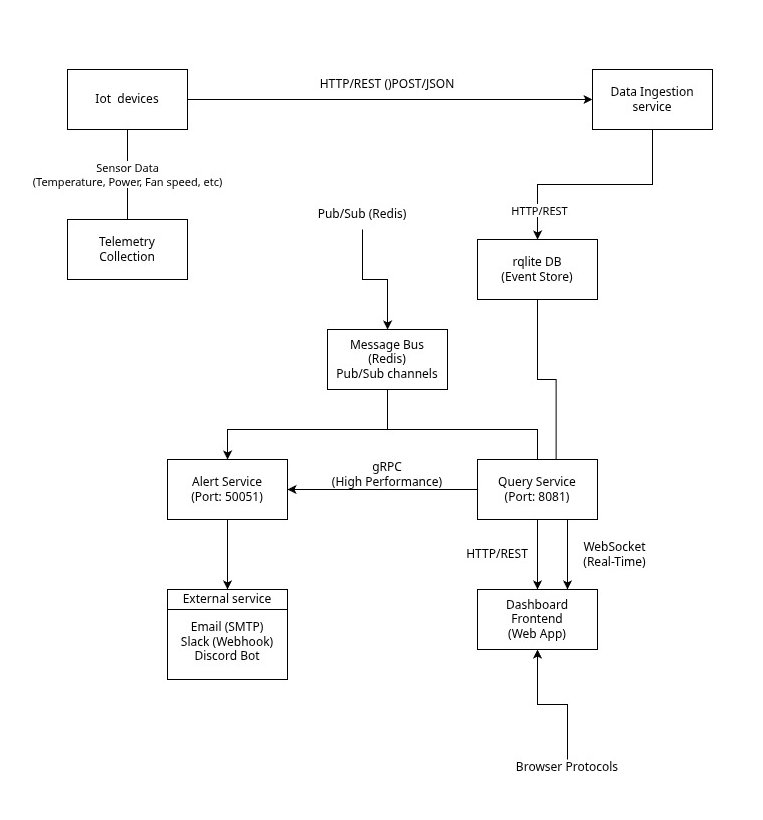

# sensors-analyze

## Descripción del Proyecto

**sensors-analyze** es un sistema distribuido de microservicios diseñado para la ingesta, procesamiento, análisis y monitoreo de datos de sensores IoT en tiempo real. El proyecto implementa una arquitectura robusta y escalable que permite manejar grandes volúmenes de datos de sensores con alta disponibilidad y tolerancia a fallos.

## Arquitectura de Microservicios

El sistema está compuesto por los siguientes microservicios especializados:

(Notese que la comunicación con los microservicios que no tienen flechas son bidireccionales)

### 🐍 **Python Script** simulando los iot devices (Python)
- **Tecnologías**: Python
- **Función**: Script de simulación de datos de sensores iot de GPUs- **Características**:
  - Generación de datos sintéticos de sensores
  - Envío automático de datos al servicio de ingesta
  - Simulación de diferentes tipos de sensores

### 🔄 **Ingestion Service** (Node.js/Express)
- **Tecnologías**: Node.js, Express, Redis, RQLite
- **Puerto**: 5002
- **Función**: Servicio de ingesta de datos de sensores IoT
- **Características**:
  - API REST para recepción de datos de sensores
  - Validación y procesamiento de datos en tiempo real
  - Almacenamiento distribuido en cluster RQLite
  - Cache con Redis para optimización de rendimiento

### 🚨 **Alert Service** (Python/gRPC)
- **Tecnologías**: Python, gRPC, Redis, Protocol Buffers
- **Puerto**: 50051
- **Función**: Sistema de alertas y notificaciones
- **Características**:
  - Comunicación de alta performance con gRPC
  - Procesamiento de reglas de alertas
  - Gestión de notificaciones en tiempo real
  - Integración con Redis para persistencia de alertas

### 🔍 **Query Service** (Node.js/WebSockets)
- **Tecnologías**: Node.js, Express, WebSockets, RQLite, Redis
- **Puertos**: 8081 (HTTP), 8082 (WebSockets)
- **Función**: Servicio de consultas y análisis de datos
- **Características**:
  - API REST para consultas históricas
  - WebSockets para actualizaciones en tiempo real
  - Consultas optimizadas sobre cluster distribuido
  - CORS habilitado para integración frontend

### 📊 **Monitor Display** (Next.js/React)
- **Tecnologías**: Next.js 16, React 19, TypeScript, Tailwind CSS
- **Función**: Dashboard web para visualización y monitoreo
- **Características**:
  - Interfaz moderna y responsiva
  - Componentes UI con Radix UI
  - Visualización en tiempo real de datos de sensores
  - Dashboard interactivo con métricas y gráficos

## Infraestructura y Base de Datos

### 🗄️ **RQLite Cluster** (5 nodos)
- **Tecnología**: RQLite 9.2.1 (SQLite distribuido)
- **Configuración**: Cluster de 5 nodos con algoritmo Raft
- **Características**:
  - Alta disponibilidad y tolerancia a fallos
  - Consistencia fuerte con consenso Raft
  - Replicación automática entre nodos
  - Health checks y recuperación automática

### ⚡ **Redis Cache**
- **Tecnología**: Redis 7
- **Puerto**: 6379
- **Función**: Sistema de cache distribuido
- **Características**:
  - Cache de alta velocidad para consultas frecuentes
  - Almacenamiento temporal de alertas
  - Optimización de rendimiento del sistema

### 🌐 **Traefik (Load Balancer)**
- **Tecnología**: Traefik v2.10
- **Puertos**: 80 (HTTP), 8080 (Dashboard)
- **Función**: Reverse proxy y load balancer
- **Características**:
  - Balanceador de carga automático
  - Health checks de servicios
  - Dashboard de monitoreo
  - Enrutamiento dinámico de servicios

## Despliegue con Docker

El proyecto utiliza **Docker** y **Docker Compose** para la orquestación completa del sistema:

### 🐳 **Contenedorización**
- Cada microservicio está conteneurizado individualmente
- Dockerfile optimizado para cada tecnología
- Imágenes base oficiales para máxima compatibilidad
- Multi-stage builds para optimización de tamaño

### 🔗 **Orquestación**
- **docker-compose.yml** para despliegue completo
- Red interna `rqlite-network` para comunicación entre servicios
- Volúmenes persistentes para datos de RQLite
- Dependencias y orden de inicio configurados
- Health checks para todos los servicios críticos

### 🚀 **Comandos de Despliegue**

```bash
# Levantar todo el sistema
docker-compose up -d

# Ver estado de servicios
docker-compose ps

# Ver logs de un servicio específico
docker-compose logs -f [servicio]

# Detener el sistema
docker-compose down

# Ingresar a un nodo de rqlite
docker exec -it rqlite-node1 sh

# Ingresar a la consola interactiva
rqlite

# Crear las tablas y los indices de schema.sql dentro de la consola interactiva
```


## Puntos de Acceso

- **Traefik Dashboard**: http://localhost:8080
- **RQLite Cluster**: http://localhost:80
- **Ingestion API**: http://localhost:5002
- **Query Service**: http://localhost:8081
- **Query WebSockets**: ws://localhost:8082
- **Alert Service gRPC**: localhost:50051
- **Redis**: localhost:6379

## Características Destacadas

- ✅ **Alta Disponibilidad**: Cluster RQLite con 5 nodos
- ✅ **Escalabilidad**: Arquitectura de microservicios independientes
- ✅ **Tiempo Real**: WebSockets y gRPC para comunicación instantánea
- ✅ **Tolerancia a Fallos**: Health checks y recuperación automática
- ✅ **Monitoreo**: Dashboard Traefik y métricas integradas
- ✅ **Cache Inteligente**: Redis para optimización de rendimiento
- ✅ **Conteneurización**: Despliegue completo con Docker
- ✅ **APIs Modernas**: REST, gRPC y WebSockets